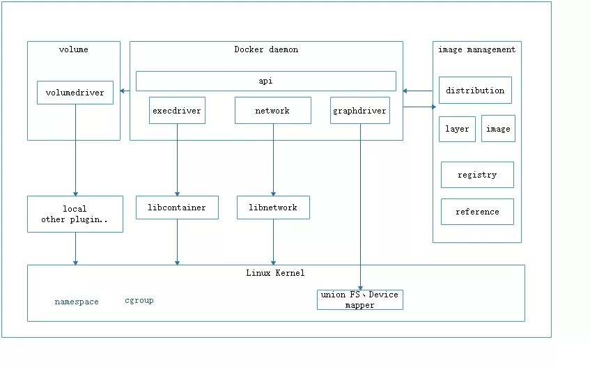
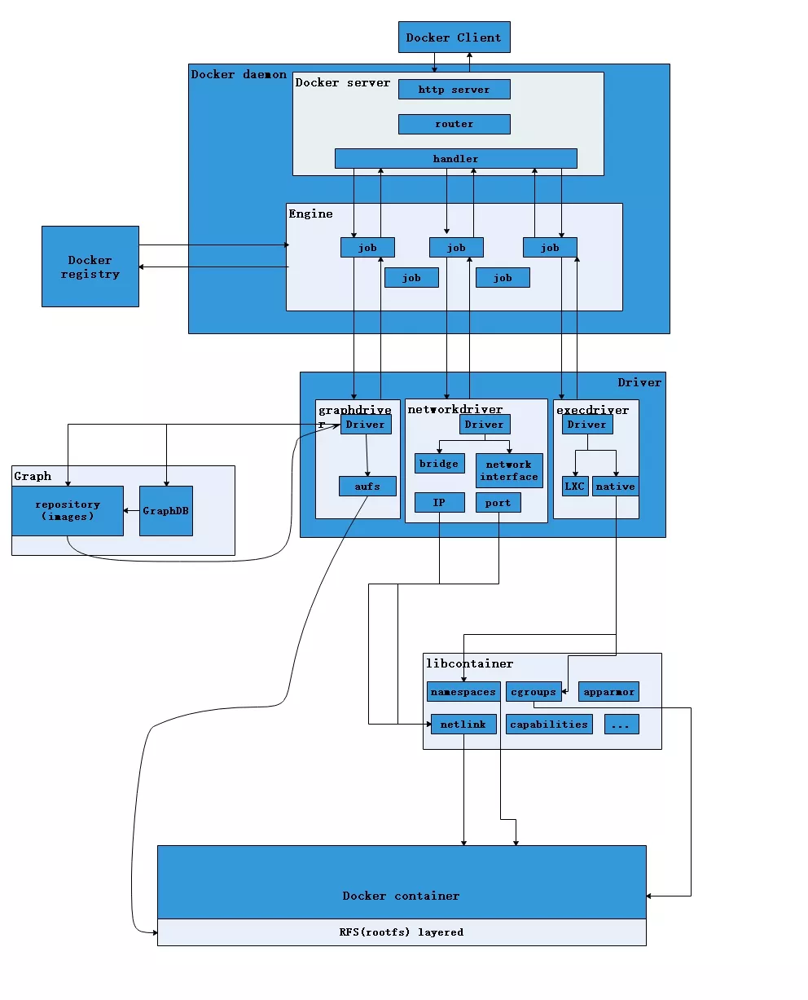
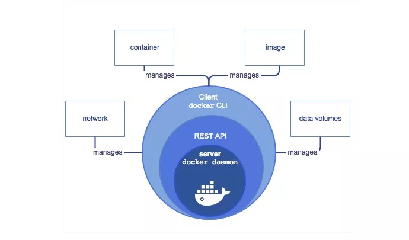
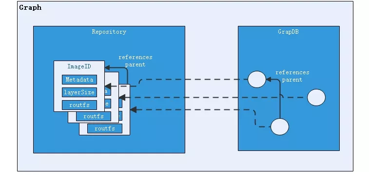
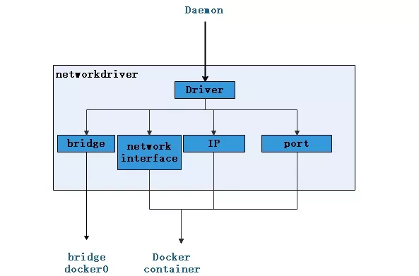
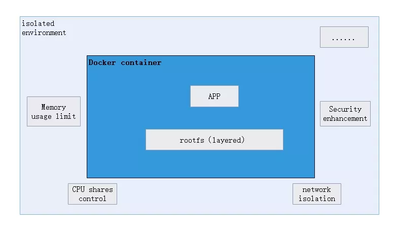

## 终于有人把 Docker 讲清楚了


> 作者 | 乐章
>
> 来源 | cnblogs.com/zhangxingeng/p/11236968.html
>
> 编辑：Java技术栈（id：javastack）


## **一、简介** 


### 

### **1、了解Docker的前生LXC**


LXC为Linux Container的简写。可以提供轻量级的虚拟化，以便隔离进程和资源，而且不需要提供指令解释机制以及全虚拟化的其他复杂性。相当于C++中的NameSpace。容器有效地将由单个操作系统管理的资源划分到孤立的组中，以更好地在孤立的组之间平衡有冲突的资源使用需求。


与传统虚拟化技术相比，它的优势在于：

（1）与宿主机使用同一个内核，性能损耗小；

（2）不需要指令级模拟；

（3）不需要即时(Just-in-time)编译；

（4）容器可以在CPU核心的本地运行指令，不需要任何专门的解释机制；

（5）避免了准虚拟化和系统调用替换中的复杂性；

（6）轻量级隔离，在隔离的同时还提供共享机制，以实现容器与宿主机的资源共享。

总结：Linux Container是一种轻量级的虚拟化的手段。


Linux Container提供了在单一可控主机节点上支持多个相互隔离的server container同时执行的机制。Linux Container有点像chroot，提供了一个拥有自己进程和网络空间的虚拟环境，但又有别于虚拟机，因为lxc是一种操作系统层次上的资源的虚拟化。


### **2、LXC与docker什么关系？**


docker并不是LXC替代品，docker底层使用了LXC来实现，LXC将linux进程沙盒化，使得进程之间相互隔离，并且能够课哦内阁制各进程的资源分配。

在LXC的基础之上，docker提供了一系列更强大的功能。


### **3、什么是docker**


docker是一个开源的应用容器引擎，基于go语言开发并遵循了apache2.0协议开源。

docker可以让开发者打包他们的应用以及依赖包到一个轻量级、可移植的容器中，然后发布到任何流行的linux服务器，也可以实现虚拟化。

容器是完全使用沙箱机制，相互之间不会有任何接口（类iphone的app），并且容器开销极其低。


### 

### **4、docker官方文档**


https://docs.docker.com/


### 

### **5、为什么docker越来越受欢迎**


官方话语：


- 容器化越来越受欢迎，因为容器是：


- - 灵活：即使是最复杂的应用也可以集装箱化。
  - 轻量级：容器利用并共享主机内核。
  - 可互换：您可以即时部署更新和升级。
  - 便携式：您可以在本地构建，部署到云，并在任何地方运行。
  - 可扩展：您可以增加并自动分发容器副本。
  - 可堆叠：您可以垂直和即时堆叠服务。


### 

- ### 镜像和容器（contalners）


通过镜像启动一个容器，一个镜像是一个可执行的包，其中包括运行应用程序所需要的所有内容包含代码，运行时间，库、环境变量、和配置文件。

容器是镜像的运行实例，当被运行时有镜像状态和用户进程，可以使用docker ps 查看。


- ### 容器和虚拟机


容器时在linux上本机运行，并与其他容器共享主机的内核，它运行的一个独立的进程，不占用其他任何可执行文件的内存，非常轻量。


虚拟机运行的是一个完成的操作系统，通过虚拟机管理程序对主机资源进行虚拟访问，相比之下需要的资源更多。

 


###  

### **6、docker版本**


Docker Community Edition（CE）社区版

Enterprise Edition(EE) 商业版


###  

### **7、docker和openstack的几项对比**


 


### **8、容器在内核中支持2种重要技术**


docker本质就是宿主机的一个进程，docker是通过namespace实现资源隔离，通过cgroup实现资源限制，通过写时复制技术（copy-on-write）实现了高效的文件操作（类似虚拟机的磁盘比如分配500g并不是实际占用物理磁盘500g）


1）namespaces 名称空间

 


 

 2）control Group 控制组


cgroup的特点是：　　　　　　

- cgroup的api以一个伪文件系统的实现方式，用户的程序可以通过文件系统实现cgroup的组件管理
- cgroup的组件管理操作单元可以细粒度到线程级别，另外用户可以创建和销毁cgroup，从而实现资源载分配和再利用
- 所有资源管理的功能都以子系统的方式实现，接口统一子任务创建之初与其父任务处于同一个cgroup的控制组


四大功能：


- 资源限制：可以对任务使用的资源总额进行限制
- 优先级分配：通过分配的cpu时间片数量以及磁盘IO带宽大小，实际上相当于控制了任务运行优先级
- 资源统计：可以统计系统的资源使用量，如cpu时长，内存用量等
- 任务控制：cgroup可以对任务执行挂起、恢复等操作


### 

### **9、了解docker三个重要概念**


1）image镜像


docker镜像就是一个只读模板，比如，一个镜像可以包含一个完整的centos，里面仅安装apache或用户的其他应用，镜像可以用来创建docker容器，另外docker提供了一个很简单的机制来创建镜像或者更新现有的镜像，用户甚至可以直接从其他人那里下周一个已经做好的镜像来直接使用


2）container容器


docker利用容器来运行应用，容器是从镜像创建的运行实例，它可以被启动，开始、停止、删除、每个容器都是互相隔离的，保证安全的平台，可以吧容器看做是要给简易版的linux环境（包括root用户权限、镜像空间、用户空间和网络空间等）和运行再其中的应用程序

 

3）repostory仓库


仓库是集中存储镜像文件的沧桑，registry是仓库主从服务器，实际上参考注册服务器上存放着多个仓库，每个仓库中又包含了多个镜像，每个镜像有不同的标签（tag）


仓库分为两种，公有参考，和私有仓库，最大的公开仓库是docker Hub，存放了数量庞大的镜像供用户下周，国内的docker pool，这里仓库的概念与Git类似，registry可以理解为github这样的托管服务。


### 

### **10、docker的主要用途**


官方就是Bulid 、ship、run any app/any where，编译、装载、运行、任何app/在任意地放都能运行。

就是实现了应用的封装、部署、运行的生命周期管理只要在glibc的环境下，都可以运行。

运维生成环境中：docker化。


- 发布服务不用担心服务器的运行环境，所有的服务器都是自动分配docker，自动部署，自动安装，自动运行
- 再不用担心其他服务引擎的磁盘问题，cpu问题，系统问题了
- 资源利用更出色
- 自动迁移，可以制作镜像，迁移使用自定义的镜像即可迁移，不会出现什么问题
- 管理更加方便了


### 

### **11、docker改变了什么**


- 面向产品：产品交付
- 面向开发：简化环境配置
- 面向测试：多版本测试
- 面向运维：环境一致性
- 面向架构：自动化扩容（微服务）


 

## **二、docker架构**


### 

### **1、总体架构**





- distribution 负责与docker registry交互，上传洗澡镜像以及v2 registry 有关的源数据
- registry负责docker registry有关的身份认证、镜像查找、镜像验证以及管理registry mirror等交互操作
- image 负责与镜像源数据有关的存储、查找，镜像层的索引、查找以及镜像tar包有关的导入、导出操作
- reference负责存储本地所有镜像的repository和tag名，并维护与镜像id之间的映射关系
- layer模块负责与镜像层和容器层源数据有关的增删改查，并负责将镜像层的增删改查映射到实际存储镜像层文件的graphdriver模块
- graghdriver是所有与容器镜像相关操作的执行者


### 

### **2、docker架构2**


如果觉得上面架构图比较乱可以看这个架构：


### 


从上图不难看出，用户是使用Docker Client与Docker Daemon建立通信，并发送请求给后者。


而Docker Daemon作为Docker架构中的主体部分，首先提供Server的功能使其可以接受Docker Client的请求；而后Engine执行Docker内部的一系列工作，每一项工作都是以一个Job的形式的存在。


Job的运行过程中，当需要容器镜像时，则从Docker Registry中下载镜像，并通过镜像管理驱动graphdriver将下载镜像以Graph的形式存储；当需要为Docker创建网络环境时，通过网络管理驱动networkdriver创建并配置Docker容器网络环境；当需要限制Docker容器运行资源或执行用户指令等操作时，则通过execdriver来完成。


而libcontainer是一项独立的容器管理包，networkdriver以及execdriver都是通过libcontainer来实现具体对容器进行的操作。当执行完运行容器的命令后，一个实际的Docker容器就处于运行状态，该容器拥有独立的文件系统，独立并且安全的运行环境等。

 


### **3、docker架构3**


再来看看另外一个架构，这个个架构就简单清晰指明了server/client交互，容器和镜像、数据之间的一些联系。




这个架构图更加清晰了架构


docker daemon就是docker的守护进程即server端，可以是远程的，也可以是本地的，这个不是C/S架构吗，客户端Docker client 是通过rest api进行通信。


docker cli 用来管理容器和镜像，客户端提供一个只读镜像，然后通过镜像可以创建多个容器，这些容器可以只是一个RFS（Root file system根文件系统），也可以ishi一个包含了用户应用的RFS，容器再docker client中只是要给进程，两个进程之间互不可见。


用户不能与server直接交互，但可以通过与容器这个桥梁来交互，由于是操作系统级别的虚拟技术，中间的损耗几乎可以不计。


## **三、docker架构2各个模块的功能（带完善）**


主要的模块有：Docker Client、Docker Daemon、Docker Registry、Graph、Driver、libcontainer以及Docker container。　　　


### 

### **1、docker client**


docker client 是docker架构中用户用来和docker daemon建立通信的客户端，用户使用的可执行文件为docker，通过docker命令行工具可以发起众多管理container的请求。


docker client可以通过一下三宗方式和docker daemon建立通信：tcp://host:port;unix:path_to_socket;fd://socketfd。，docker client可以通过设置命令行flag参数的形式设置安全传输层协议(TLS)的有关参数，保证传输的安全性。


docker client发送容器管理请求后，由docker daemon接受并处理请求，当docker client 接收到返回的请求相应并简单处理后，docker client 一次完整的生命周期就结束了，当需要继续发送容器管理请求时，用户必须再次通过docker可以执行文件创建docker client。


### 

### **2、docker daemon**


docker daemon 是docker架构中一个常驻在后台的系统进程，功能是：接收处理docker client发送的请求。该守护进程在后台启动一个server，server负载接受docker client发送的请求；接受请求后，server通过路由与分发调度，找到相应的handler来执行请求。


docker daemon启动所使用的可执行文件也为docker，与docker client启动所使用的可执行文件docker相同，在docker命令执行时，通过传入的参数来判别docker daemon与docker client。


docker daemon的架构可以分为：docker server、engine、job。daemon


### 

### **3、docker server** 


docker server在docker架构中时专门服务于docker client的server，该server的功能时：接受并调度分发docker client发送的请求，架构图如下：

　　　　


在Docker的启动过程中，通过包gorilla/mux（golang的类库解析），创建了一个mux.Router，提供请求的路由功能。在Golang中，gorilla/mux是一个强大的URL路由器以及调度分发器。该mux.Router中添加了众多的路由项，每一个路由项由HTTP请求方法（PUT、POST、GET或DELETE）、URL、Handler三部分组成。


若Docker Client通过HTTP的形式访问Docker Daemon，创建完mux.Router之后，Docker将Server的监听地址以及mux.Router作为参数，创建一个httpSrv=http.Server{}，最终执行httpSrv.Serve()为请求服务。


在Server的服务过程中，Server在listener上接受Docker Client的访问请求，并创建一个全新的goroutine来服务该请求。在goroutine中，首先读取请求内容，然后做解析工作，接着找到相应的路由项，随后调用相应的Handler来处理该请求，最后Handler处理完请求之后回复该请求。


需要注意的是：Docker Server的运行在Docker的启动过程中，是靠一个名为”serveapi”的job的运行来完成的。原则上，Docker Server的运行是众多job中的一个，但是为了强调Docker Server的重要性以及为后续job服务的重要特性，将该”serveapi”的job单独抽离出来分析，理解为Docker Server。


### 

### **4、engine**


Engine是Docker架构中的运行引擎，同时也Docker运行的核心模块。它扮演Docker container存储仓库的角色，并且通过执行job的方式来操纵管理这些容器。


在Engine数据结构的设计与实现过程中，有一个handler对象。该handler对象存储的都是关于众多特定job的handler处理访问。举例说明，Engine的handler对象中有一项为：{“create”: daemon.ContainerCreate,}，则说明当名为”create”的job在运行时，执行的是daemon.ContainerCreate的handler。


### 

### **5、job**


一个Job可以认为是Docker架构中Engine内部最基本的工作执行单元。Docker可以做的每一项工作，都可以抽象为一个job。例如：在容器内部运行一个进程，这是一个job；创建一个新的容器，这是一个job，从Internet上下载一个文档，这是一个job；包括之前在Docker Server部分说过的，创建Server服务于HTTP的API，这也是一个job，等等。


Job的设计者，把Job设计得与Unix进程相仿。比如说：Job有一个名称，有参数，有环境变量，有标准的输入输出，有错误处理，有返回状态等。


### 

### **6、docker registry**


Docker Registry是一个存储容器镜像的仓库。而容器镜像是在容器被创建时，被加载用来初始化容器的文件架构与目录。


在Docker的运行过程中，Docker Daemon会与Docker Registry通信，并实现搜索镜像、下载镜像、上传镜像三个功能，这三个功能对应的job名称分别为”search”，”pull” 与 “push”。


其中，在Docker架构中，Docker可以使用公有的Docker Registry，即大家熟知的Docker Hub，如此一来，Docker获取容器镜像文件时，必须通过互联网访问Docker Hub；同时Docker也允许用户构建本地私有的Docker Registry，这样可以保证容器镜像的获取在内网完成。


### 

### **7、Graph**


Graph在Docker架构中扮演已下载容器镜像的保管者，以及已下载容器镜像之间关系的记录者。一方面，Graph存储着本地具有版本信息的文件系统镜像，另一方面也通过GraphDB记录着所有文件系统镜像彼此之间的关系。


Graph的架构如下：




其中，GraphDB是一个构建在SQLite之上的小型图数据库，实现了节点的命名以及节点之间关联关系的记录。它仅仅实现了大多数图数据库所拥有的一个小的子集，但是提供了简单的接口表示节点之间的关系。


同时在Graph的本地目录中，关于每一个的容器镜像，具体存储的信息有：该容器镜像的元数据，容器镜像的大小信息，以及该容器镜像所代表的具体rootfs。

 

**8、driver**


Driver是Docker架构中的驱动模块。通过Driver驱动，Docker可以实现对Docker容器执行环境的定制。由于Docker运行的生命周期中，并非用户所有的操作都是针对Docker容器的管理，另外还有关于Docker运行信息的获取，Graph的存储与记录等。因此，为了将Docker容器的管理从Docker Daemon内部业务逻辑中区分开来，设计了Driver层驱动来接管所有这部分请求。


在Docker Driver的实现中，可以分为以下三类驱动：graphdriver、networkdriver和execdriver。


graphdriver主要用于完成容器镜像的管理，包括存储与获取。即当用户需要下载指定的容器镜像时，graphdriver将容器镜像存储在本地的指定目录；同时当用户需要使用指定的容器镜像来创建容器的rootfs时，graphdriver从本地镜像存储目录中获取指定的容器镜像。


在graphdriver的初始化过程之前，有4种文件系统或类文件系统在其内部注册，它们分别是aufs、btrfs、vfs和devmapper。而Docker在初始化之时，通过获取系统环境变量”DOCKER_DRIVER”来提取所使用driver的指定类型。而之后所有的graph操作，都使用该driver来执行。


graphdriver的架构如下：


networkdriver的用途是完成Docker容器网络环境的配置，其中包括Docker启动时为Docker环境创建网桥；Docker容器创建时为其创建专属虚拟网卡设备；以及为Docker容器分配IP、端口并与宿主机做端口映射，设置容器防火墙策略等。networkdriver的架构如下：



 

execdriver作为Docker容器的执行驱动，负责创建容器运行命名空间，负责容器资源使用的统计与限制，负责容器内部进程的真正运行等。在execdriver的实现过程中，原先可以使用LXC驱动调用LXC的接口，来操纵容器的配置以及生命周期，而现在execdriver默认使用native驱动，不依赖于LXC。


具体体现在Daemon启动过程中加载的ExecDriverflag参数，该参数在配置文件已经被设为”native”。这可以认为是Docker在1.2版本上一个很大的改变，或者说Docker实现跨平台的一个先兆。execdriver架构如下：


### **9、libcontainer**


libcontainer是Docker架构中一个使用Go语言设计实现的库，设计初衷是希望该库可以不依靠任何依赖，直接访问内核中与容器相关的API。


正是由于libcontainer的存在，Docker可以直接调用libcontainer，而最终操纵容器的namespace、cgroups、apparmor、网络设备以及防火墙规则等。这一系列操作的完成都不需要依赖LXC或者其他包。libcontainer架构如下：


另外，libcontainer提供了一整套标准的接口来满足上层对容器管理的需求。或者说，libcontainer屏蔽了Docker上层对容器的直接管理。又由于libcontainer使用Go这种跨平台的语言开发实现，且本身又可以被上层多种不同的编程语言访问，因此很难说，未来的Docker就一定会紧紧地和Linux捆绑在一起。而于此同时，Microsoft在其著名云计算平台Azure中，也添加了对Docker的支持，可见Docker的开放程度与业界的火热度。


暂不谈Docker，由于libcontainer的功能以及其本身与系统的松耦合特性，很有可能会在其他以容器为原型的平台出现，同时也很有可能催生出云计算领域全新的项目。


### **10、docker container**


Docker container（Docker容器）是Docker架构中服务交付的最终体现形式。


Docker按照用户的需求与指令，订制相应的Docker容器：


- 用户通过指定容器镜像，使得Docker容器可以自定义rootfs等文件系统；
- 用户通过指定计算资源的配额，使得Docker容器使用指定的计算资源；
- 用户通过配置网络及其安全策略，使得Docker容器拥有独立且安全的网络环境；
- 用户通过指定运行的命令，使得Docker容器执行指定的工作。




## **四、docker简单使用**


### **1、安装**

```
yum install docker -y systemctl enable dockersystemctl start docker
```

注意：启动前应当设置源


```
vim /usr/lib/systemd/system/docker.service
```


这里设置阿里的，注册阿里云账户号每个用户都有：

```
[root@web1 ~]# vim /usr/lib/systemd/system/docker.service
[Unit]Description=Docker Application Container EngineDocumentation=http://docs.docker.comAfter=network.targetWants=docker-storage-setup.serviceRequires=docker-cleanup.timer
[Service]Type=notifyNotifyAccess=mainEnvironmentFile=-/run/containers/registries.confEnvironmentFile=-/etc/sysconfig/dockerEnvironmentFile=-/etc/sysconfig/docker-storageEnvironmentFile=-/etc/sysconfig/docker-networkEnvironment=GOTRACEBACK=crashEnvironment=DOCKER_HTTP_HOST_COMPAT=1Environment=PATH=/usr/libexec/docker:/usr/bin:/usr/sbinExecStart=/usr/bin/dockerd-current --registry-mirror=https://rfcod7oz.mirror.aliyuncs.com  #这个值可以登陆阿里云账号请参考下图          --add-runtime docker-runc=/usr/libexec/docker/docker-runc-current           --default-runtime=docker-runc           --exec-opt native.cgroupdriver=systemd           --userland-proxy-path=/usr/libexec/docker/docker-proxy-current           --init-path=/usr/libexec/docker/docker-init-current           --seccomp-profile=/etc/docker/seccomp.json           $OPTIONS           $DOCKER_STORAGE_OPTIONS           $DOCKER_NETWORK_OPTIONS           $ADD_REGISTRY           $BLOCK_REGISTRY           $INSECURE_REGISTRY           $REGISTRIESExecReload=/bin/kill -s HUP $MAINPIDLimitNOFILE=1048576LimitNPROC=1048576LimitCORE=infinityTimeoutStartSec=0Restart=on-abnormalKillMode=process
[Install]WantedBy=multi-user.target
```

　　

　

### **2、docker版本查询**


```
[root@web1 ~]# docker versionClient: Version:         1.13.1 API version:     1.26 Package version: docker-1.13.1-96.gitb2f74b2.el7.centos.x86_64 Go version:      go1.10.3 Git commit:      b2f74b2/1.13.1 Built:           Wed May  1 14:55:20 2019 OS/Arch:         linux/amd64
Server: Version:         1.13.1 API version:     1.26 (minimum version 1.12) Package version: docker-1.13.1-96.gitb2f74b2.el7.centos.x86_64 Go version:      go1.10.3 Git commit:      b2f74b2/1.13.1 Built:           Wed May  1 14:55:20 2019 OS/Arch:         linux/amd64 Experimental:    false
```


### **3、搜索下载镜像**


```
docker pull alpine　　　　　　　　　　#下载镜像docker search nginx　　　　　　　　　 #查看镜像docker pull nginx
```


### **4、查看已经下载的镜像**


```
[root@web1 ~]# docker imagesREPOSITORY          TAG                 IMAGE ID            CREATED             SIZEzxg/my_nginx        v1                  b164f4c07c64        8 days ago          126 MBzxg/my_nginx        latest              f07837869dfc        8 days ago          126 MBdocker.io/nginx     latest              e445ab08b2be        2 weeks ago         126 MBdocker.io/alpine    latest              b7b28af77ffe        3 weeks ago         5.58 MBdocker.io/centos    latest              9f38484d220f        4 months ago        202 MB[root@web1 ~]#
```


### **5、导出镜像**


```
docker  save nginx >/tmp/nginx.tar.gz
```


### **6、删除镜像**


```
docker rmi -f nginx
```


### **7、导入镜像**


```
docker load </tmp/nginx.tar.gz
```

###  

### **8、默认配置文件**


```
vim /usr/lib/systemd/system/docker.service 
```


如果更改存储目录就添加　　


```
--graph=/opt/docker
```


如果更改DNS——默认采用宿主机的dns


```
--dns=xxxx的方式指定
```


### **9、运行hello world**


这里用centos镜像echo一个hello word


```
[root@web1 overlay2]#  docker images
```


### **10、运行一个容器-run**


```
[root@web1 overlay2]# docker run -it alpine sh   #运行并进入alpine
```


后台运行（-d后台运行）（--name添加一个名字）


```
[root@web1 overlay2]# docker run -it -d --name test1 
```


还有一种-rm参数，ctrl+c后就删除，可以测试环境用，生成环境用的少


```
[root@web1 overlay2]# docker run -it  --rm --name centos nginx   
```


### **11、如何进入容器**


三种方法，上面已经演示了一种

第一种，需要容器本身的pid及util-linux，不推荐，暂时不演示了

第二种，不分配bash终端的一种实施操作，不推荐，这种操作如果在开一个窗口也能看到操作的指令，所有人都能看到。


```
[root@web1 overlay2]# docker ps
[root@web1 overlay2]# docker attach mynginx
```


第三种：exec方式，终端时分开的，推荐


```
[root@web1 overlay2]# docker exec -it mynginx sh
```


### **12、查看docker进程及删除容器**


```
[root@web1 overlay2]# docker ps -a 　　　　　　#-a :显示所有的容器，包括未运行的CONTAINER ID      [root@web1 overlay2]# docker rm 9fc796e928d7 #rm时删除一个或多个容器9fc796e928d7
```


### **13、查看容器详细信息**


并不需要进入到容器里面，通过查看详细信息看到了刚才运行的nginx，宿主机curl ip地址访问一下运行情况。


```
[root@web1 overlay2]#  docker inspect mynginx
[root@web1 overlay2]#
```


### **14、查看日志**


-f  挂起这个终端，动态查看日志


```
[root@web1 ~]# docker logs  -f mynginx
```


**参考文章：**

https://cloud.tencent.com/developer/article/1006116  

https://yq.aliyun.com/articles/65145

https://blog.51cto.com/10085711/2068290

https://www.cnblogs.com/zuxing/articles/8717415.html